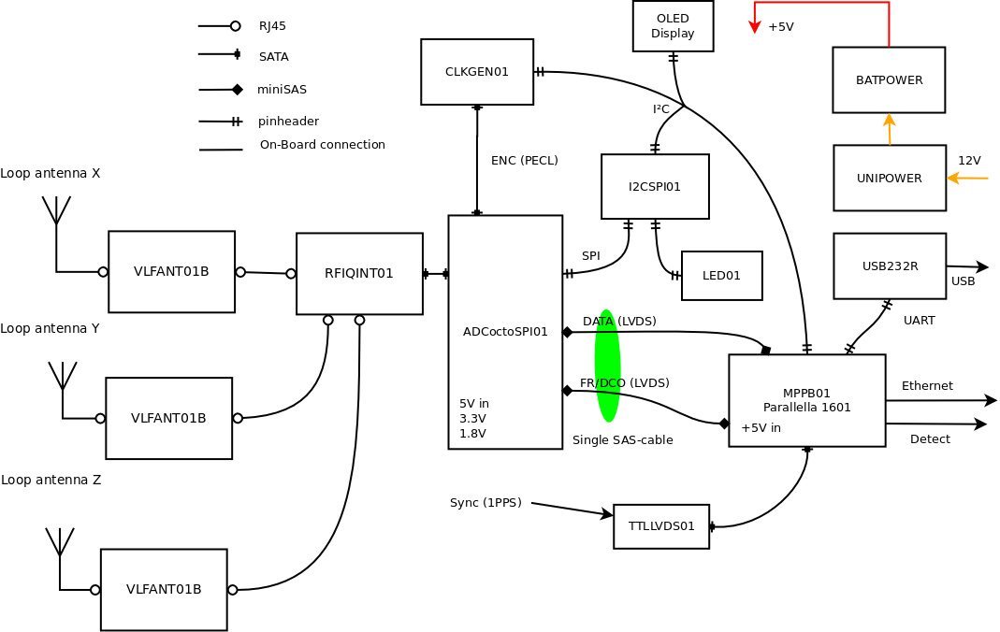
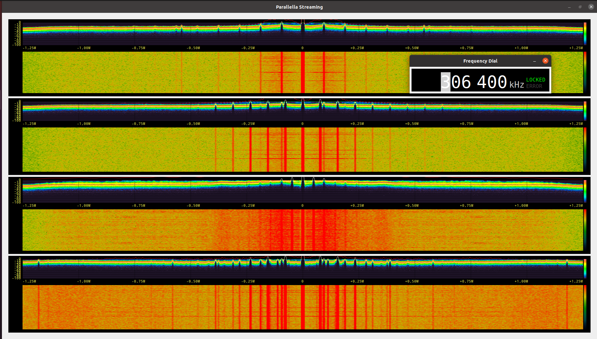

### Radio Storm Monitorig Station

Mobile VLF lightning mapping station based on multi-directional loop antenna array.
The array could be mounted stationary or mobile on the car roof.

#### Block Schematics

#### Visualization

The device uses [fosphor](https://osmocom.org/projects/sdr/wiki/fosphor) for real-time spectral vizualization.

    sudo apt-get install nvidia-opencl-dev opencl-headers

