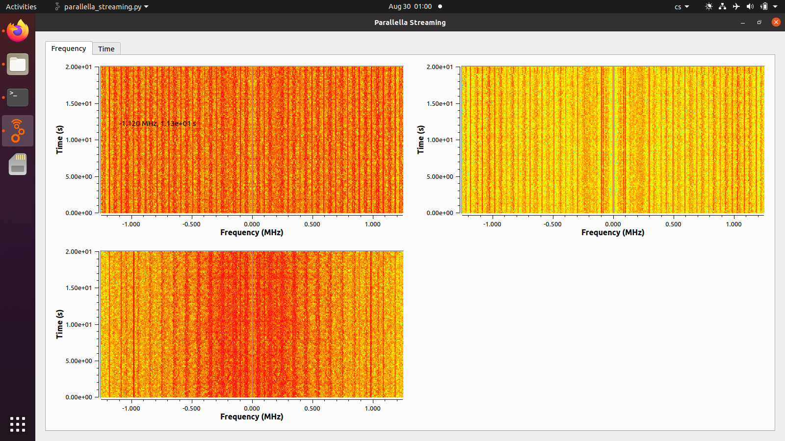
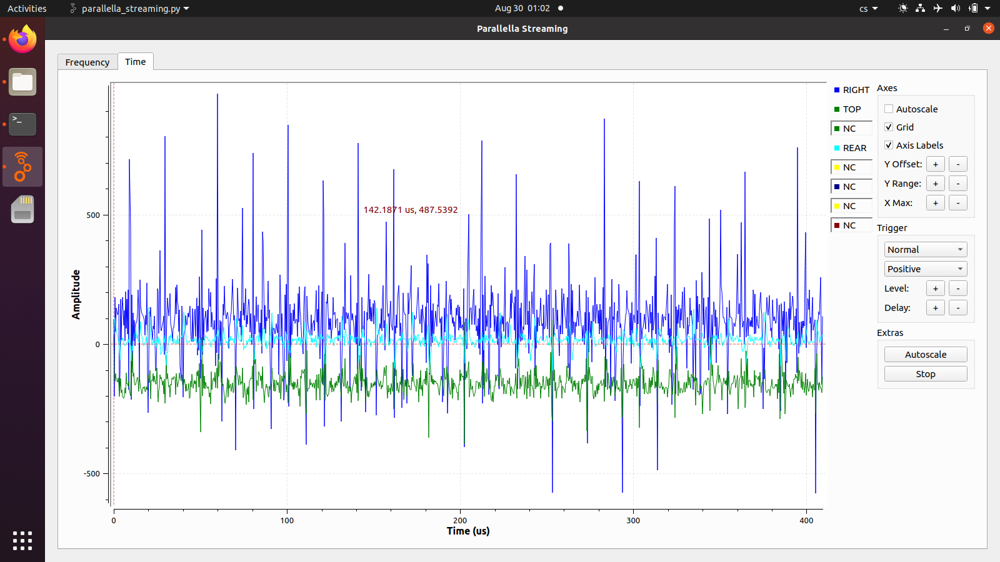

### Radio Storm Monitorig Station

Mobile VLF lightning mapping station based on multi-directional loop antenna array.
The array could be mounted stationary or mobile on the car roof.

#### Block Schematics

#### Visualization

