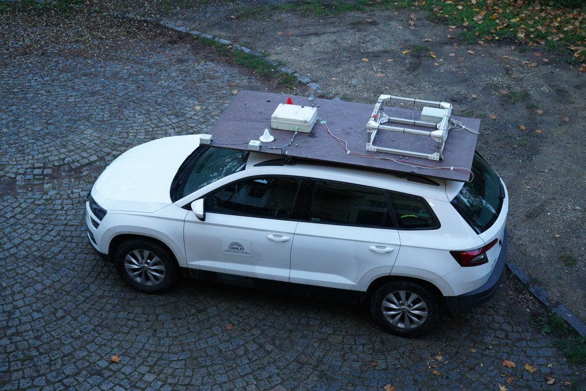
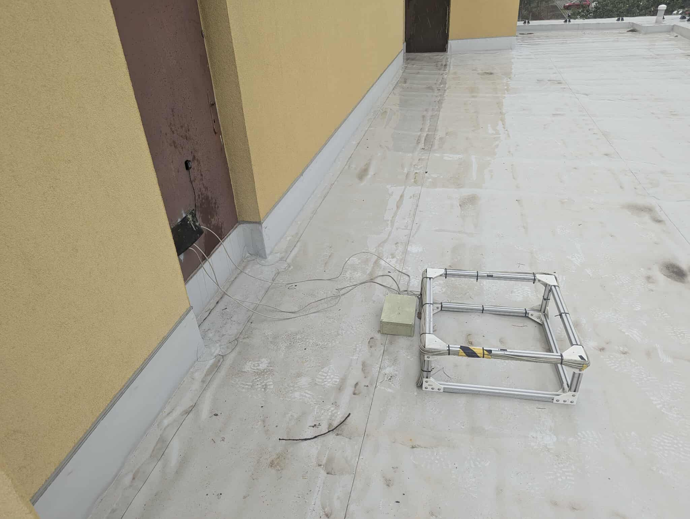
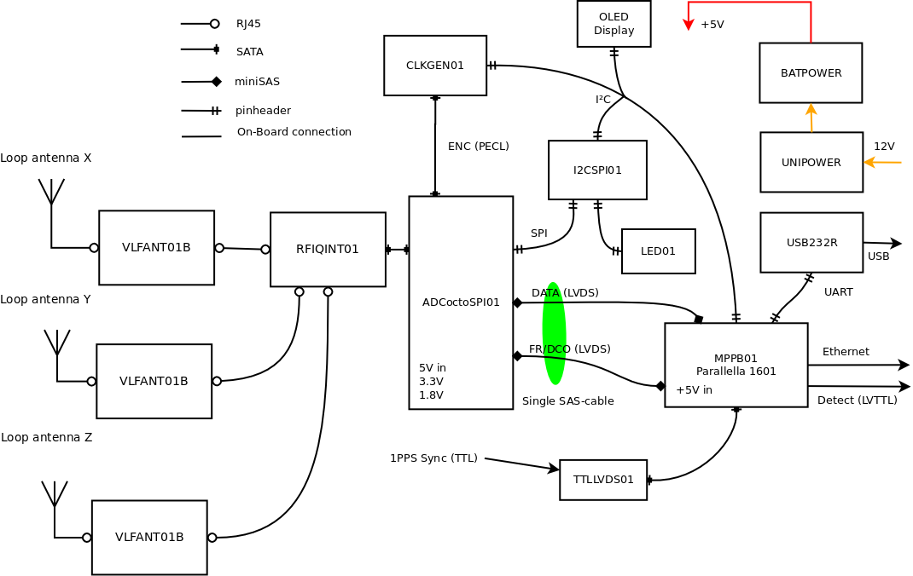
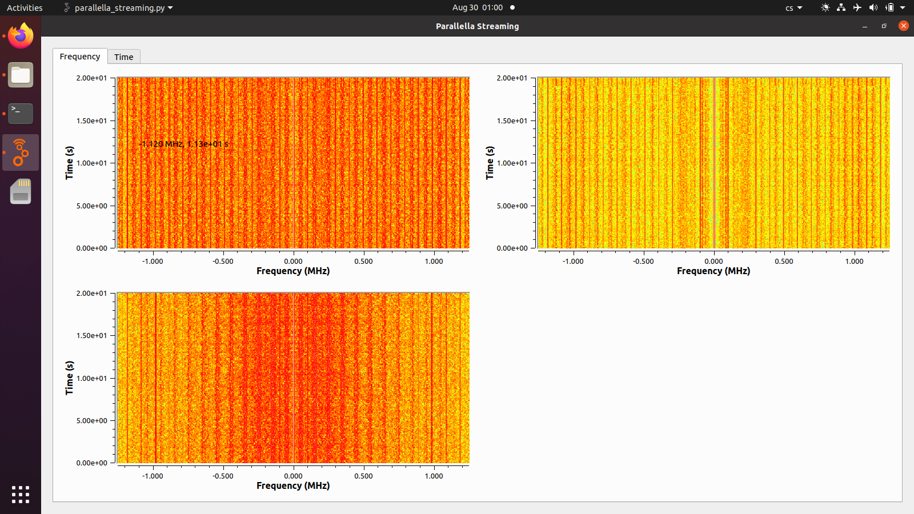
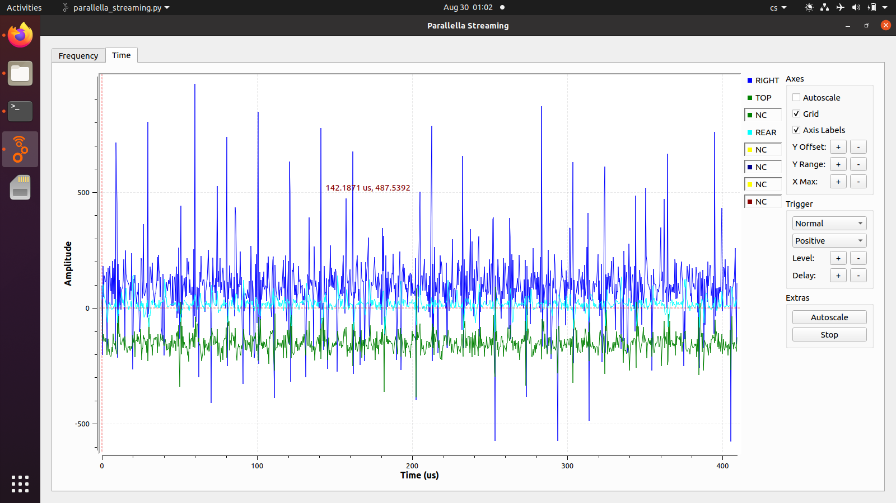

# RSMS02 – VLF Radio Storm Monitoring Station

VLF lightning mapping station based on a multi‑directional loop antenna array. The array can be mounted stationary or on a vehicle roof. The station digitizes three orthogonal loop channels and provides real‑time monitoring, triggering, and recording.

The instrument processes lightning RF signatures and can generate hardware triggers for auxiliary instruments (e.g., high‑speed cameras).

## Key Features and Parameters

* **Sampling rate (SDR):** **10 MSPS** (per channel)
* **Sample precision:** 12‑bit
* **Time precision of sample timestamping:** 100 ns
* **Antenna array:** 3‑loop orthogonal VLF antenna
* **Trigger output to other instruments:** TTL compatible
* **Pre‑trigger capture:** Supported (configurable)
* **On‑board compute:** Zynq XC7Z01 SoC (ARM® Cortex®‑A9) with Epiphany III E16G301 coprocessor
* **OS:** Linux (Ubuntu)
* **RAM:** 1 GB
* **Storage:** microSD (typ. 16 GB)
* **Network:** 1000BASE‑T Ethernet for data offload and control
* **Power input:** 9–14.8 V (vehicle compatible)
* **Preview latency:** ~2 s
* **Mounting:** Roof‑rack or stationary mast options for the loop array; receiver in weather‑protected enclosure

> **Note:** Maximum recording length and pre‑trigger window depend on configuration and decimation settings. (Maximal recording length: 1.46 seconds at 10 MSPS)

## System Block Diagram

## Front‑End and Digitizer

The station’s multi‑channel digitizer is implemented with the [ADCoctoSPI01 octal high‑speed ADC module](https://www.mlab.cz/module/ADCoctoSPI01/). It integrates TI AFE5801 (8× VGA + 8× 12‑bit ADC up to 65 MSPS) with LVDS data output and SPI control. The module connects via miniSAS (SFF‑8087) to the processing board.

## Signal Channels Technical Characteristics

**Digitizer:** TI AFE5801 on ADCoctoSPI01 module (typical conditions unless stated)

| Parameter                       |         Typical value | Notes                                                  |
| ------------------------------- | --------------------: | ------------------------------------------------------ |
| ADC resolution                  |           12 bits | Per channel                                            |
| Effective number of bits (ENOB) |       ≈ 10.5 bits | From SNR ≈ 65 dBFS using ENOB ≈ (SNR − 1.76) / 6.02    |
| Full‑scale input                |        2 Vpp diff | Max linear differential swing of antenna output        |
| Input referred noise            |        5.5 nV/√Hz | At VGA gain = 31 dB                                    |
| VGA gain range                  |   −5 dB to +31 dB | Step size 0.125 dB (fine) and 1 dB (coarse)    |
| SNR                             |         ≈ 65 dBFS | At 65 MSPS, −1 dBFS input (typ.)                       |
| THD                             |        ≈ −65 dBFS | 5 MHz input, max gain (typ.)                           |
| SINAD                    |   ≈ 63–65 dB | Depends on harmonic content; near SNR when THD ≪ noise |
| Input impedance                 |    ≈ 5 kΩ | Differential; ~2 pF input capacitance                  |

## Antenna Array and Front‑End Conditioning

Follow star‑ground topology at the receiver input; isolate loop shields from chassis at one point to minimize common‑mode pickup.

## Triggering and Recording

* **Real‑time trigger:** Energy based (configurable in firmware/software)
* **Pre‑/post‑trigger windows:** Configurable.
* **External trigger out:** TTL pulse for synchronizing high‑speed cameras or other instruments.

## Networking and Control

* **On‑device Web-based UI:** Web/CLI tools for configuration, monitoring, and data capture
* **File format:** Binary recordings with sidecar metadata (timestamps, channel map, gain, filter settings)

## Visualization Examples

#### Relevant scientific publications

  * [In situ ground-based mobile measurement of lightning events above central Europe](https://amt.copernicus.org/articles/16/547/2023/)

