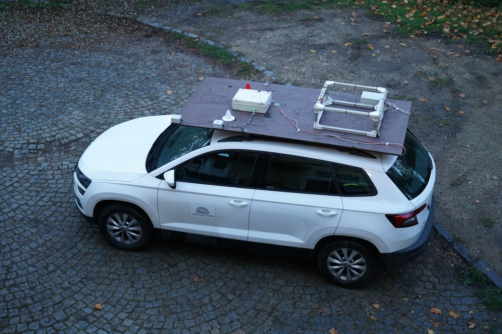
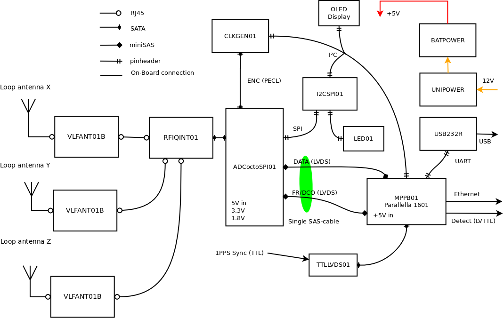

### Radio Storm Monitorig Station

Mobile VLF lightning mapping station based on multi-directional loop antenna array.
The array could be mounted stationary or mobile on the car roof.

##### Fatures and parameters

  * Time precision of samples recording:  100 ns
	* Network connection: 1000M metalic ethernet
	* FPGA type: Zynq XC7Z01
	* Central processing unit: ARM® Cortex®-A9
	* Cumputing coprocessor: Epiphany III  E16G301
	* Operating system: Linux Ubuntu
	* RAM size: 1 GB
	* Recording media: uSD card
	* Recording media size: 16GB
	* Maximal recording lenght: 1.46 s
	* Ability to record signal before trigger: yes
	* Pre-trigger recording lenght: 0.7 s
	* Sampling rate: 2.5 MHz
	* Sample bit depth: 12bit.
	* Antenna array: 3 loop ortogonal VLF antenna
	* Trigger output to other instruments: Yes, TTL
	* Delay to rendering signal preview: 2 s
	* Input power voltage: 9 - 14.8 V (Car compatible)

#### Block Schematics

#### Visualization

